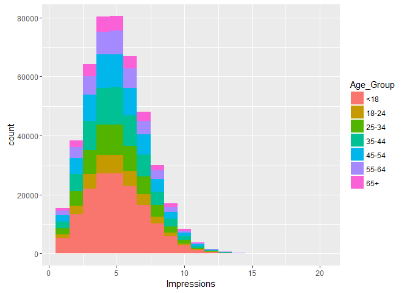
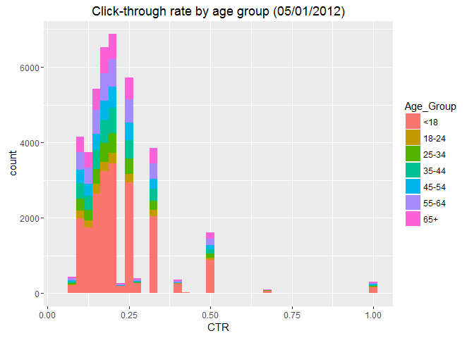

# Exploring Website Click Data
Sharon Teo  
June 23, 2016  

# Getting the Data

```r
fileLocation <- "http://stat.columbia.edu/~rachel/datasets/nyt1.csv"
data1 <- read.csv(url(fileLocation))
```

# Take a look at the first 5 rows

```r
head(data1)
```

```
##   Age Gender Impressions Clicks Signed_In
## 1  36      0           3      0         1
## 2  73      1           3      0         1
## 3  30      0           3      0         1
## 4  49      1           3      0         1
## 5  47      1          11      0         1
## 6  47      0          11      1         1
```
# Overview of the structure of the data 

```r
str(data1)
```

```
## 'data.frame':	458441 obs. of  5 variables:
##  $ Age        : int  36 73 30 49 47 47 0 46 16 52 ...
##  $ Gender     : int  0 1 0 1 1 0 0 0 0 0 ...
##  $ Impressions: int  3 3 3 3 11 11 7 5 3 4 ...
##  $ Clicks     : int  0 0 0 0 0 1 1 0 0 0 ...
##  $ Signed_In  : int  1 1 1 1 1 1 0 1 1 1 ...
```
# Task 1
# Create a new variable ageGroup that categorizes age into following groups:        < 18, 18–24, 25–34, 35–44, 45–54, 55–64 and 65+.


```r
data1$Age_Group <- cut(data1$Age, c(-Inf, 18, 24, 34, 44, 54, 64, Inf))

levels(data1$Age_Group) <- c("<18", "18-24", "25-34", "35-44", "45-54", "55-64", "65+")
```

# New age groups

```r
head(data1)
```

```
##   Age Gender Impressions Clicks Signed_In Age_Group
## 1  36      0           3      0         1     35-44
## 2  73      1           3      0         1       65+
## 3  30      0           3      0         1     25-34
## 4  49      1           3      0         1     45-54
## 5  47      1          11      0         1     45-54
## 6  47      0          11      1         1     45-54
```

# Task 2
# Plot distributions of number impressions and click-through-rate (CTR = click/impression) for the age groups.


# Create a subset of data1 to exclude rows where there are no impressions (if there are no impressions, we assume there will be no clicks). Name the new object d1

```r
d1 <- subset(data1, Impressions>0)
```
# Add a column to d1 called CTR containing the click-through-rate

```r
d1$CTR <- d1$Clicks/d1$Impressions
head(d1)
```

```
##   Age Gender Impressions Clicks Signed_In Age_Group        CTR
## 1  36      0           3      0         1     35-44 0.00000000
## 2  73      1           3      0         1       65+ 0.00000000
## 3  30      0           3      0         1     25-34 0.00000000
## 4  49      1           3      0         1     45-54 0.00000000
## 5  47      1          11      0         1     45-54 0.00000000
## 6  47      0          11      1         1     45-54 0.09090909
```
# Plot the distribution of Impressions>0, grouped by Age_Group, using the ggplot2   package


```r
library(ggplot2) # used for visualizations
```

```
## Warning: package 'ggplot2' was built under R version 3.2.5
```

```r
ggplot(subset(d1, Impressions>0), aes(x=Impressions, fill=Age_Group))+
    geom_histogram(binwidth=1)
```

<!-- -->

# Plot the distribution of CTR>0, grouped by Age_Group

```r
ggplot(subset(d1, CTR>0), aes(x=CTR, fill=Age_Group))+
    labs(title="Click-through rate by age group (05/01/2012)")+
    geom_histogram(binwidth=.025)
```

<!-- -->


