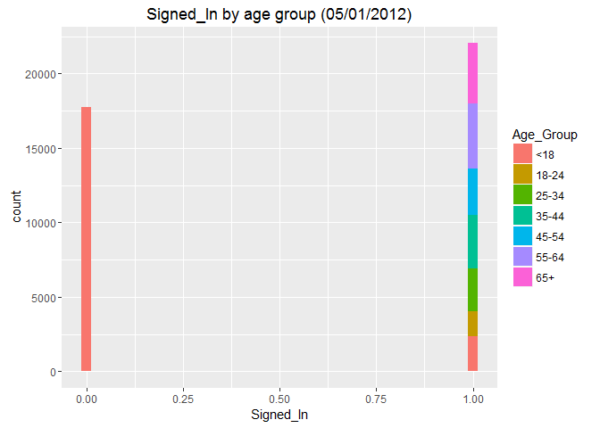

# Exploring Website Click Data
Sharon Teo  
July 4th, 2016  

# Getting the Data

```r
fileLocation <- "http://stat.columbia.edu/~rachel/datasets/nyt1.csv"
data1 <- read.csv(url(fileLocation))
```

# Take a look at the first 5 rows

```r
head(data1)
```

```
##   Age Gender Impressions Clicks Signed_In
## 1  36      0           3      0         1
## 2  73      1           3      0         1
## 3  30      0           3      0         1
## 4  49      1           3      0         1
## 5  47      1          11      0         1
## 6  47      0          11      1         1
```
# Overview of the structure of the data 

```r
str(data1)
```

```
## 'data.frame':	458441 obs. of  5 variables:
##  $ Age        : int  36 73 30 49 47 47 0 46 16 52 ...
##  $ Gender     : int  0 1 0 1 1 0 0 0 0 0 ...
##  $ Impressions: int  3 3 3 3 11 11 7 5 3 4 ...
##  $ Clicks     : int  0 0 0 0 0 1 1 0 0 0 ...
##  $ Signed_In  : int  1 1 1 1 1 1 0 1 1 1 ...
```
# Task 1
# Create a new variable ageGroup that categorizes age into following groups:        < 18, 18–24, 25–34, 35–44, 45–54, 55–64 and 65+.


```r
data1$Age_Group <- cut(data1$Age, c(-Inf, 18, 24, 34, 44, 54, 64, Inf))

levels(data1$Age_Group) <- c("<18", "18-24", "25-34", "35-44", "45-54", "55-64", "65+")
```

# New age groups

```r
head(data1)
```

```
##   Age Gender Impressions Clicks Signed_In Age_Group
## 1  36      0           3      0         1     35-44
## 2  73      1           3      0         1       65+
## 3  30      0           3      0         1     25-34
## 4  49      1           3      0         1     45-54
## 5  47      1          11      0         1     45-54
## 6  47      0          11      1         1     45-54
```

# Task 2
# Plot distributions of number impressions and click-through-rate (CTR = click/impression) for the age groups.


# Create a subset of data1 to exclude rows where there are no impressions (if there are no impressions, we assume there will be no clicks). Name the new object Impsub

```r
Impsub <- subset(data1, Impressions>0)
```
# Add a column to Impsub called CTR containing the click-through-rate

```r
Impsub$CTR <- Impsub$Clicks/Impsub$Impressions
head(Impsub)
```

```
##   Age Gender Impressions Clicks Signed_In Age_Group        CTR
## 1  36      0           3      0         1     35-44 0.00000000
## 2  73      1           3      0         1       65+ 0.00000000
## 3  30      0           3      0         1     25-34 0.00000000
## 4  49      1           3      0         1     45-54 0.00000000
## 5  47      1          11      0         1     45-54 0.00000000
## 6  47      0          11      1         1     45-54 0.09090909
```

# Plot the distribution of Impressions>0, grouped by Age_Group, using the ggplot2 package


```r
library(ggplot2) # used for visualizations
ggplot(subset(Impsub, Impressions>0), aes(x=Impressions, fill=Age_Group))+
    geom_histogram(binwidth=1)
```

<!-- -->

# Plot the distribution of CTR>0, grouped by Age_Group

```r
ggplot(subset(Impsub, CTR>0), aes(x=CTR, fill=Age_Group))+
    labs(title="Click-through rate by age group (05/01/2012)")+
    geom_histogram(binwidth=.025)
```

<!-- -->

# Define a new variable to segment users based on click-throughrate behavior. CTR< 0.2, 0.2<=CTR <0.4, 0.4<= CTR<0.6, 0.6<=CTR<0.8, CTR>0.8
  

```r
Impsub$CTR_group <- cut(Impsub$CTR, c(-Inf, 0.2, 0.4, 0.6, 0.8, Inf))
levels(Impsub$CTR_group) <- c("<0.2", "0.2-0.4", "0.4-0.6", "0.6-0.8", "0.8+")
```
# New CTR groups

```r
head(Impsub)
```

```
##   Age Gender Impressions Clicks Signed_In Age_Group        CTR CTR_group
## 1  36      0           3      0         1     35-44 0.00000000      <0.2
## 2  73      1           3      0         1       65+ 0.00000000      <0.2
## 3  30      0           3      0         1     25-34 0.00000000      <0.2
## 4  49      1           3      0         1     45-54 0.00000000      <0.2
## 5  47      1          11      0         1     45-54 0.00000000      <0.2
## 6  47      0          11      1         1     45-54 0.09090909      <0.2
```
# Create a table of CTRGroup vs AgeGroupcounts

```r
CTRAge <- table(Impsub$CTR_group,Impsub$Age_Group)
CTRAge
```

```
##          
##              <18  18-24  25-34  35-44  45-54  55-64    65+
##   <0.2    148412  34540  56980  69424  62936  43147  27261
##   0.2-0.4   5735    391    689    820    776   1104   1108
##   0.4-0.6    918     68    106    118    113    168    156
##   0.6-0.8     76      2      7      4      0      7     10
##   0.8+       162     13     19     28     20     36     21
```

# Get the total number of Male, Impressions, Clicks and Signed_In 
  
#### Total number of Male

```r
NumMale=sum(Impsub$Gender)
NumMale
```

```
## [1] 167146
```

#### Total number of Clicks

```r
Clicks=sum(Impsub$Clicks)
Clicks
```

```
## [1] 42449
```
#### Total number of Signed_In

```r
Signed_In=sum(Impsub$Signed_In)
Signed_In
```

```
## [1] 319198
```

# Get the mean of Age, Impressions, Clicks, CTR and percentage of males and signed_In

#### Mean of age = 29.48 

#### Mean of Impressions = 5.04

#### Mean of Clicks = 0.09322

#### Mean of CTR =.01847

#### Percentage of males=36.70%

#### Percentage signed in =70.09%
  

```r
summary(Impsub)
```

```
##       Age             Gender        Impressions         Clicks       
##  Min.   :  0.00   Min.   :0.0000   Min.   : 1.000   Min.   :0.00000  
##  1st Qu.:  0.00   1st Qu.:0.0000   1st Qu.: 3.000   1st Qu.:0.00000  
##  Median : 31.00   Median :0.0000   Median : 5.000   Median :0.00000  
##  Mean   : 29.48   Mean   :0.3671   Mean   : 5.041   Mean   :0.09322  
##  3rd Qu.: 48.00   3rd Qu.:1.0000   3rd Qu.: 6.000   3rd Qu.:0.00000  
##  Max.   :108.00   Max.   :1.0000   Max.   :20.000   Max.   :4.00000  
##                                                                      
##    Signed_In     Age_Group           CTR            CTR_group     
##  Min.   :0.000   <18  :155303   Min.   :0.00000   <0.2   :442700  
##  1st Qu.:0.000   18-24: 35014   1st Qu.:0.00000   0.2-0.4: 10623  
##  Median :1.000   25-34: 57801   Median :0.00000   0.4-0.6:  1647  
##  Mean   :0.701   35-44: 70394   Mean   :0.01847   0.6-0.8:   106  
##  3rd Qu.:1.000   45-54: 63845   3rd Qu.:0.00000   0.8+   :   299  
##  Max.   :1.000   55-64: 44462   Max.   :1.00000                   
##                  65+  : 28556
```
# Get the means of Impressions, Clicks, CTR and percentage of males and signed_In by AgeGroup.

```r
Means <- aggregate(Impsub[, 2:5], list(Impsub$Age_Group), mean)
Means
```

```
##   Group.1    Gender Impressions     Clicks Signed_In
## 1     <18 0.0790648    5.033534 0.14167788 0.1231528
## 2   18-24 0.5339864    5.043240 0.04880905 1.0000000
## 3   25-34 0.5319977    5.026055 0.05081227 1.0000000
## 4   35-44 0.5317072    5.054749 0.05202148 1.0000000
## 5   45-54 0.5292192    5.045172 0.05062260 1.0000000
## 6   55-64 0.5359633    5.053484 0.10246952 1.0000000
## 7     65+ 0.3632512    5.046925 0.15233226 1.0000000
```
# Plot the distribution of Signed_In, grouped by Age_Group

```r
ggplot(subset(Impsub, CTR>0), aes(x=Signed_In, fill=Age_Group))+
    labs(title="Signed_In by age group (05/01/2012)")+
    geom_histogram(binwidth=.025)
```

<!-- -->


